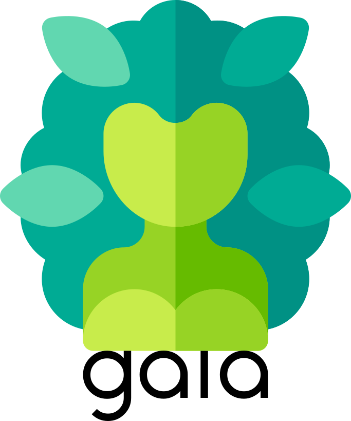
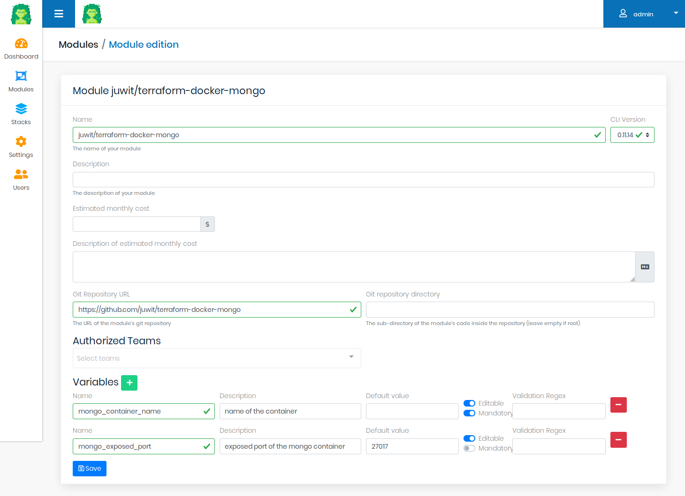
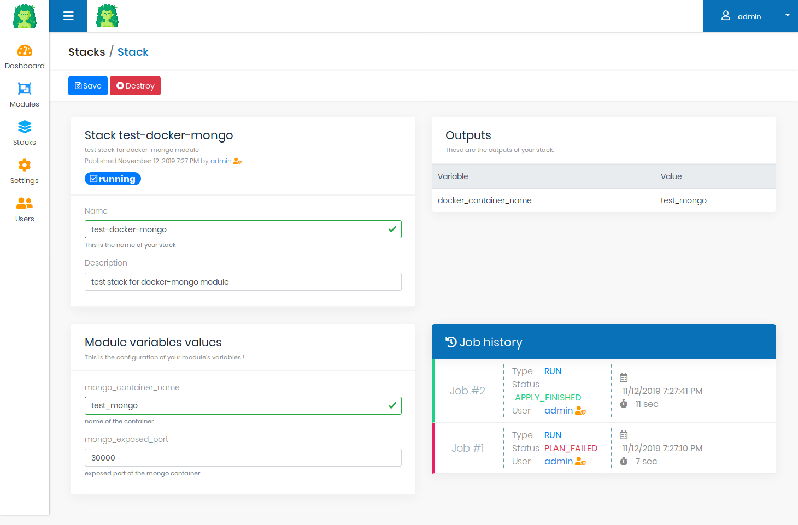
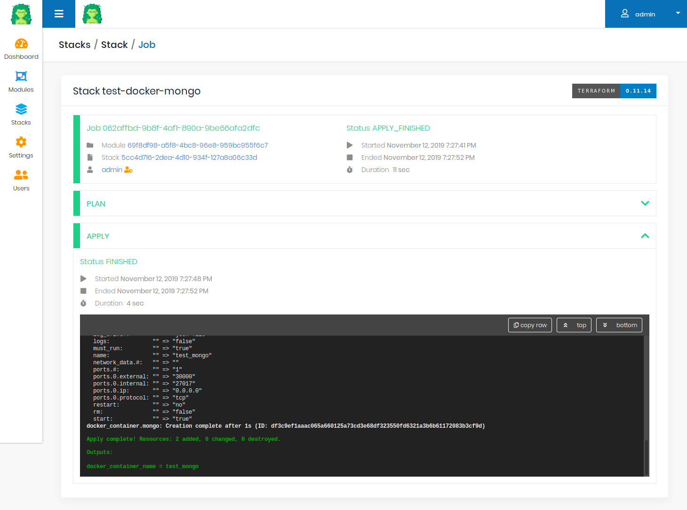

<p align="center">
  
</p>

Gaia is a Terraform UI for your Terraform modules, and self-service infrastructure.

[](https://travis-ci.com/gaia-app/gaia)
[](https://sonarcloud.io/dashboard?id=gaia-app%3Agaia)
[](https://sonarcloud.io/dashboard?id=gaia-app%3Agaia)

[](https://dependabot.com)

## What is it?

Gaia is a web application to import and run your Terraform modules.
It features : 
* importing modules from source code (Github/Gitlab)
* validation of Terraform variables values (mandatory variables, regex-based validation)
* setting up default values or masking variables for your users
* running modules (plan/apply/destroy) in one click and managing Terraform state
* team management

## Screenshots

The module edition view allows you to edit module details, such as variables and their validation.



The stack view helps you to input your variable values, and shows job results and latest output values.



The job view shows you the Terraform workflow, and the logs of the `plan` and `apply` logs



## Requirements

Gaia needs :
 * a docker daemon (used to run Terraform itself)
 * and a MongoDb database (to store its data)
   * we currently support MongoDb 4.0 only

## Quick start

Start Gaia with `docker-compose` quickly !

Clone this repository, and just run `docker-compose up -d`. 

The docker-compose will start a Gaia server, listening on http://localhost:8080, and a MongoDb database.

Default credentials for entering:

- Admin account `ROLE_ADMIN`:

  ```
  Username: admin
  Password: admin123
  ```

- User account `ROLE_USER`:

  ```
  Username: user
  Password: user123
  ```

## Contributors

Gaia is made with ❤️ in  🇫🇷 by [Cyril DUBUISSON](https://github.com/cdubuisson) and [Julien WITTOUCK](https://github.com/juwit)
